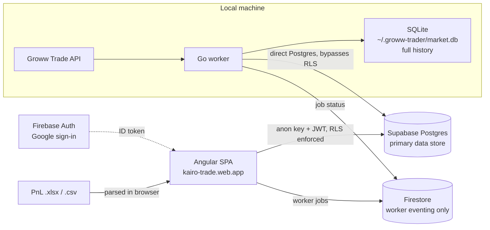

# Groww Trader

Personal trading workstation: a **local Go worker** ingests market data into **SQLite** and **Supabase Postgres**, and the **Angular UI** reads Supabase. Identity is **Firebase Auth**; Firestore is now used only for worker job eventing.

Groww P&L statements are parsed **in the browser** (upload `.xlsx`/`.csv` under Settings) and the resulting trades are persisted to Supabase.

## Architecture



| Layer | What |
|---|---|
| **Supabase Postgres** | Primary store. Trades, uploads, client accounts, stock profiles, daily analytics, unrealised holdings, trade plans, registry, watchlists, and the shared market tables the UI reads. Every user table has RLS scoped to the Firebase uid. |
| **SQLite** | Worker-local full history: years of OHLC, fundamentals, PE history, volume shocker rankings, symbol meta. Never shipped wholesale to the cloud. |
| **Firestore** | Worker eventing only — `workerJobs`, `worker/listen`, `worker/status`. |
| **Firebase Auth** | Google sign-in. The ID token is what Supabase RLS verifies, so authorization lives in the database, not the client. |
| **Worker** | EOD full book (~200+ symbols), hot-set quotes during market hours, relative-strength INTRADAY/BTST signals. |

> **Note:** the worker still publishes slim market snapshots to Firestore (`internal/firebase/publisher_slim.go`), but the UI no longer reads them — `StockFirestoreService` is a misnomer and reads Supabase. That Firestore publish path is legacy and safe to retire.

## Quick start

### 1. Firebase setup

1. Create a project at https://console.firebase.google.com
2. Enable **Authentication** (Google sign-in only) and **Firestore**
3. Create a **service account** key for the local worker
4. Update `.firebaserc` with your project ID
5. Deploy rules: `firebase deploy --only firestore:rules,firestore:indexes`

Auth is the perimeter for Supabase too, so keep Google as the only enabled provider and leave
"one account per email address" on — the RLS gate trusts the verified email claim in the
Firebase ID token.

The web config is generated, not committed: `npm start` and `npm run build` run
`scripts/ensure-firebase-config.js` and `scripts/ensure-supabase-config.js`, which write the
gitignored `frontend/src/environments/{firebase,supabase}.config.ts`. Copy the `.example.ts`
files by hand if you want to work offline.

### 2. Supabase setup

1. Create a project at https://supabase.com
2. Apply the migrations in `supabase/migrations/` in filename order — these define the schema
   **and** every RLS policy, so authorization is only correct once they're all applied
3. Put the project URL and **publishable (anon)** key in `SUPABASE_URL` / `SUPABASE_ANON_KEY`,
   or in the local `supabase.config.ts`

The anon key is meant to ship in the browser; it grants nothing on its own because every user
table is protected by RLS scoped to the authenticated Firebase uid. See
[`supabase/README.md`](supabase/README.md) for edge function deployment.

### 3. Backend worker (local)

```bash
cd backend
cp .env.example .env
# Edit: FIREBASE_PROJECT_ID, GOOGLE_APPLICATION_CREDENTIALS, SUPABASE_DB_PASSWORD

export MARKET_DATA_PROVIDER=groww
export GROWW_ACCESS_TOKEN=your-daily-token
export WATCH_SYMBOLS=RELIANCE,TCS,INFY

go run .
```

See [`backend/README.md`](backend/README.md) for ingest tiers, env vars, and HTTP API (`/docs`).

### 4. Frontend

```bash
cd frontend
npm install --legacy-peer-deps
npm start
```

Open http://localhost:4200 — sign in with Google.

### 5. Both together

```bash
./start.sh
```

## UI pages

Grouped as they appear in the sidebar. Every route except `/` is lazy-loaded.

| Section | Route | Description |
|---|---|---|
| — | `/` | **Signals** — ranked INTRADAY/BTST recommendations + volume shocker strip (default landing route) |
| Portfolio | `/dashboard` | Portfolio overview from your P&L, with per-period and per-stock trade drilldowns |
| Portfolio | `/watchlists` | Profitable and loss-making stocks from your P&L, by tier |
| Portfolio | `/analytics` | P&L charts, cumulative P&L candles, stock breakdown, holdings, and the heatmap tab |
| Portfolio | `/charges` | Brokerage and statutory charges from your report |
| Planning | `/trade-plans` | Watch list with optional size, exits, charges, and net P&L |
| Planning | `/utils` | Utility: buy/sell lot maths and charge-aware exit prices |
| Market | `/registry` | Tracked stocks with levels, labels and Screener fundamentals |
| Market | `/stocks` | Market data hydrated by the local worker |
| Market | `/momentum` | Post-results runners with targets and open trade plans |
| — | `/stock/:symbol` | Per-stock chart (SMA, MACD, RSI, system + user S/R), 52w range, PE, your trades |
| Settings | `/settings` | Upload P&L, backfill, worker status, and data management |

`/heatmap` now redirects to `/analytics`, where it lives as a tab.

## Project structure

```
groww/
├── backend/           # Local worker (Go + SQLite + Supabase + Firestore eventing)
├── frontend/          # Angular SPA (reads Supabase)
├── supabase/
│   ├── migrations/    # Schema + RLS policies (source of truth for authorization)
│   └── functions/     # Edge functions (screener-fetch)
├── scripts/ship.sh    # Commit + push + deploy in one step
├── firestore.rules
├── firestore.indexes.json
├── firebase.json
└── start.sh
```

## Development workflow

```bash
cd frontend
npm run lint     # eslint + angular-eslint (template a11y included)
npm test         # unit tests (add --watch=false --browsers=ChromeHeadless for CI)
npm run build    # development build
```

CI (`.github/workflows/ci.yml`) runs lint, unit tests and a production build on every push and
pull request. It deliberately needs **no repository secrets** — it copies the example env
configs, since nothing in the gate talks to Firebase or Supabase.

Deploys are manual and local:

```bash
./scripts/ship.sh "commit message"   # stage, commit, push, then deploy hosting
./scripts/ship.sh --deploy-only      # redeploy without committing
./scripts/ship.sh --no-deploy "msg"  # commit and push only
```

Applying database changes is a separate, manual step — migrations in `supabase/migrations/`
are not applied by CI or by `ship.sh`.

## Market data

All quotes, OHLC, and order execution use the **Groww Trade API** (`MARKET_DATA_PROVIDER=groww`). You need an active Groww API subscription and a daily access token (or API key + secret).

Set `GROWW_ENABLE_TRADING=true` to place real orders on approved recommendations (dry-run by default).
